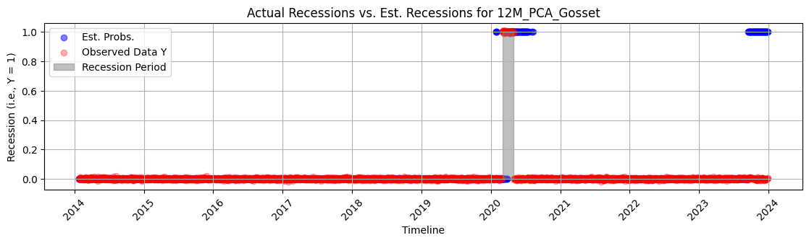
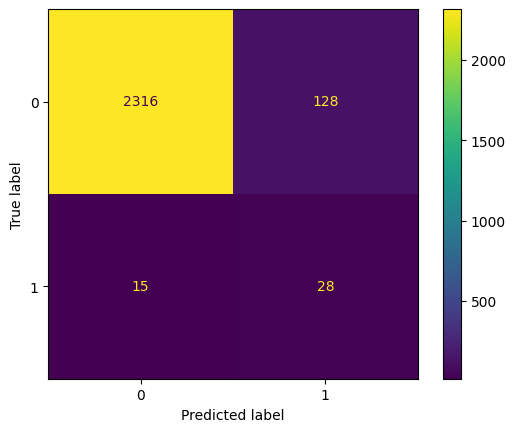
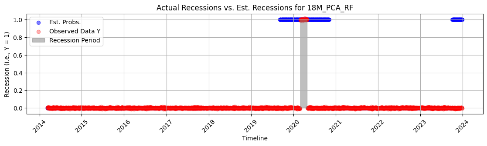
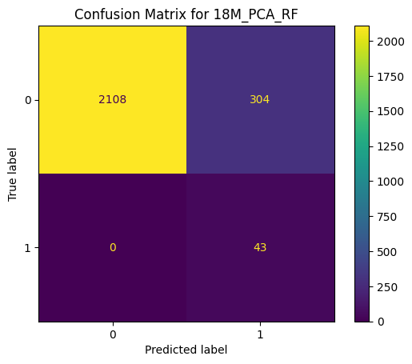

# yc-predicting
The **yield curve** is a graphical representation of the yields of bonds that have equal credit quality, but at different maturities. The most frequently reported yield curve compares the 3-month, 2-year, 5-year, 10-year, and 30-year treasury debt. In the US, the FOMC administers the fed funds rate to fulfill its dual mandate of promoting economic growth while maintaining price stability by lowering and increasing short term interest rates. At the same time, market investors (supply and demand) determine equilibrium pricing for long-term bonds, which set long-term interest rates. This relationship explains the yield curve movement:
1. If the bond market believes that the FOMC has set the fed funds rate too low, expectations of future inflation increase, which means long-term interest rates increase relative to short-term interest rates: the yield curve steepens.
2. If the market believes that the FOMC has set the fed funds rate too high, the opposite happens, and long-term interest rates decrease relative to short-term interest rates: the yield curve flattens or inverts, which typically indicates economic uncertainty or an impending recession.

## Overview
The project investigates the ability of both linear binary response models and non-linear machine learning models in estimating the probability that the US economy will enter a recession within $h$ months based on the current shape of the yield curve. The repository serves as an instructive foundation for understanding yield curve mechanics, and will be included on my curriculum vitae.

## Data
Recession data is obtained from https://fred.stlouisfed.org/series/USREC#
Daily Treasur rate is obtained from https://home.treasury.gov/resource-center/data-chart-center/interest-rates/daily-treasury-rate-archives

## Features
We specify two sets of features extracted from the yield curve. These are:
1. **PCA**: $PC_1$, $PC_2$ and $PC_3$, derived from the eigenvalues in the data's covariance matrix as the "level", "slope", "curvature" of the yield curve respectively.
2. **Slope Spread (SS)**: simply the $10yr - 2yr$ yields of the maturities.

These sets of features are used to estimate recessions 6, 12, 18 and 24 months ahead of the data using binary response models of the form $P(y_i=1|x_i)=G(x_{i}'\beta)$, where $0 < G(z) < 1$. We define $G$ as:
- **Logit Model**: $G(z)=\frac{\exp(z)}{[1+\exp(z)]}=\Delta(z)$, CDF of the Logistic Distribution
- **Probit Model**: $G(z)=\Phi(z)$, CDF of the Normal Distribution
- **Gompit Model**: $G(z)= 1 - \exp(-\exp(z))$, CDF of the Gumbel Distribution
- **Log-log Model**: $G(z)= \exp(-\exp(- z))$, CDF of the Extreme Value Distribution.
- **Gosset Model**: $G(z)=\int^z_{-\infty} \frac{\Gamma\left( \frac{\nu+1}{2} \right)}{\Gamma\left( \frac{\nu}{2} \right) \sqrt{ \pi \nu }}\left( 1+\frac{z^2}{\nu} \right)^{-\frac{\nu+1}{2}}dz$, CDF of the Student-t Distribution (with $\nu$ degrees of freedom).

Later, we also estimate the Random Forest, Support Vector Machine and XGBoost machine learning models on the features at the different lag windows to see whether we can improve our results.

## Setup
Make sure to install all required packages for the libraries through pip before running any cell.

## Usage
Navigate to main.ipynb and select the “Run All” option.

## Results
The PCA and SS Model are evaluated at different time lag windows and BRMs by chronologically dividing the time series data into an in-sample dataset and an out-of-sample dataset. During model selection, we specifically look at the PR AUC, given that a higher PR AUC value indicates better model performance as it suggests a greater ability to distinguish between the two outcomes.

The best binary response model configuration was the 12M_PCA_Gosset model with a PR AUC of 0.152. We generate the following probability plot, confusion matrix and classification report for it, respectively. 

| Class | Precision | Recall  | F1-Score | Support |
|------|----------|---------|----------|---------|
| 0    | 0.99356  | 0.94763 | 0.97005  | 2444    |
| 1    | 0.17949  | 0.65116 | 0.28141  | 43      |
| **Accuracy** |        |         | **0.94250** | 2487    |
| **Macro Avg** | 0.58653  | 0.79939 | 0.62573  | 2487    |
| **Weighted Avg** | 0.97949  | 0.94250 | 0.95815  | 2487    |

These results may suggest that the model is capable of "sensing" an upcoming recession based on the inverted yield curve, but is ultimately prevented by the Fed's ability to lower rates and save the economy. The poor performance may also suggest the presence of a non-linear relationship between the explanatory variables and dependent variable $y$. 

Therefore, we proceed with evaluating machine learning models on the same criterion. The best machine learning model configuration was the 18M_PCA_RF model with a PR AUC of 0.562. Again, we generate the same plots.

| Class | Precision | Recall  | F1-Score | Support |
|------|----------|---------|----------|---------|
| 0    | 1.00000  | 0.87396 | 0.93274  | 2412    |
| 1    | 0.12392  | 1.00000 | 0.22051  | 43      |
| **Accuracy** |        |         | **0.87617** | 2455    |
| **Macro Avg** | 0.56196  | 0.93698 | 0.57663  | 2455    |
| **Weighted Avg** | 0.98466  | 0.87617 | 0.92027  | 2455    |

The model successfully captured all recession months, 18 months ahead by the model's sensitivity for recessions. Yet, it is only 12.4% right when signaling a recession. However, a high FP rate may be preferable if it serves as an early warning system for potential economic downturns. In all regards, the model is definitely an improvement over the linear Gosset model. 

## Limitations
1. Because the recession data is reported on a monthly interval, we don’t know on what day the recession exactly started and ended.
2. At several maturities, the yield series were either inconsistent, or started later. As a result, a lot of NaN’s appeared throughout the data. For that reason, bonds with maturities "1 mo", "2 mo", "4 mo", "20 yr", "30 yr" were removed.
3. Time windows are fixed intervals of 0.5, 1, 1.5 and 2 years of trading days.
4. A simple 70-30 data split has been used instead of a walk-implementation backtest for the sake of simplicity. Its limitation is that the nature of predicting recessions may have changed over time.
